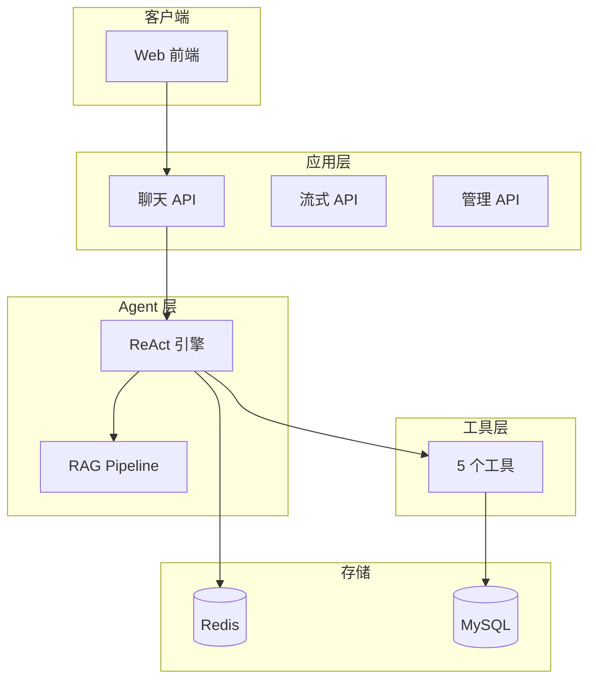

# LingXi Service - 智能客服 Agent

基于 ReAct 循环的智能客服系统，支持多轮对话、工具调用、RAG 检索增强和会话记忆。

## 功能特性

- 🤖 多轮对话管理 (ReAct 引擎)
- 🛠️ 工具调用（订单查询、退换货、转人工等）
- 📚 RAG 检索增强生成
- 🎯 Prompt 工程化 (版本管理、A/B 测试)
- 📊 Prometheus 监控指标
- ⚡ 响应缓存优化
- 🔒 XSS 安全防护

## 架构设计

详细架构图请查看 [docs/architecture.md](docs/architecture.md)



## 快速开始

### 1. 安装依赖

```bash
pip install -r requirements.txt
```

### 2. 配置环境变量

复制 `.env.example` 为 `.env`，填入你的配置：

```bash
cp .env.example .env
```

### 3. 启动 Redis

```bash
docker run -p 6379:6379 redis:7-alpine
```

### 4. 启动服务

```bash
uvicorn app.main:app --reload --port 8002
```

> **端口说明**：本项目使用 **8002** 端口，避免与其他项目冲突。

### 5. 测试

```bash
curl -X POST http://localhost:8002/chat \
  -H "Content-Type: application/json" \
  -d '{"session_id": "test-001", "message": "你好"}'
```

## API 文档

启动服务后访问：http://localhost:8002/docs

## API 端点

| 方法 | 路径 | 说明 | 认证 |
|------|------|------|------|
| GET | `/` | 聊天界面 | 否 |
| GET | `/admin` | 管理后台 | 否 |
| POST | `/chat` | 对话 | 否 |
| POST | `/chat/stream` | 对话 (SSE 流式) | 否 |
| GET | `/health` | 健康检查 | 否 |
| GET | `/metrics` | Prometheus 指标 | 否 |
| GET | `/cache/stats` | 缓存统计 | 否 |
| POST | `/cache/clear` | 清除缓存 | 否 |
| GET | `/performance/stats` | 性能统计 | 否 |
| GET | `/performance/summary` | 性能摘要 | 否 |
| GET | `/sessions` | 列出会话 | 是 |
| GET | `/sessions/{id}` | 会话详情 | 是 |
| DELETE | `/sessions/{id}` | 删除会话 | 是 |
| GET | `/sessions/{id}/slots` | 会话槽位 | 是 |
| GET | `/knowledge/faq` | 列出 FAQ | 是 |
| POST | `/knowledge/faq` | 添加 FAQ | 是 |
| PUT | `/knowledge/faq/{id}` | 更新 FAQ | 是 |
| DELETE | `/knowledge/faq/{id}` | 删除 FAQ | 是 |
| POST | `/knowledge/search` | 搜索 FAQ | 否 |
| POST | `/prompt/versions` | 创建 Prompt 版本 | 是 |
| GET | `/prompt/versions/{name}` | 获取 Prompt 版本 | 是 |
| POST | `/prompt/tests` | 创建 A/B 测试 | 是 |
| GET | `/prompt/tests/{id}` | 获取测试结果 | 是 |
| GET | `/analytics/stats` | 数据统计 | 是 |
| GET | `/analytics/conversations/{id}` | 对话详情 | 是 |
| GET | `/analytics/users/{id}/conversations` | 用户对话列表 | 是 |

## 项目结构

```
app/
├── main.py           # FastAPI 入口
├── config.py         # 配置管理
├── models/           # 数据模型
├── session/          # 会话管理
├── agent/            # ReAct 引擎
├── tools/            # 工具系统
├── api/              # API 端点
├── cache/            # 响应缓存
├── monitoring/       # 监控指标
├── security/         # 安全防护
├── db/               # 数据库
├── knowledge/        # 知识库
├── rag/              # RAG 检索增强
├── prompt/           # Prompt 工程化
└── utils/            # 工具函数

docs/
└── architecture.md   # 架构设计文档
```

## 监控

### Prometheus 指标

访问 `/metrics` 端点获取 Prometheus 格式的指标：

```bash
curl http://localhost:8002/metrics
```

指标包括：
- `lingxi_http_requests_total` - HTTP 请求总数
- `lingxi_http_request_duration_seconds` - 请求延迟
- `lingxi_llm_requests_total` - LLM 调用次数
- `lingxi_llm_tokens_total` - Token 使用量
- `lingxi_tool_calls_total` - 工具调用次数
- `lingxi_cache_hits_total` - 缓存命中次数
- `lingxi_rag_searches_total` - RAG 搜索次数

### 性能统计

```bash
# 查看性能统计
curl http://localhost:8002/performance/stats

# 查看性能摘要
curl http://localhost:8002/performance/summary
```

### 缓存统计

```bash
# 查看缓存统计
curl http://localhost:8002/cache/stats

# 清除缓存
curl -X POST http://localhost:8002/cache/clear
```

### Prompt 管理

```bash
# 创建 Prompt 版本
curl -X POST http://localhost:8002/prompt/versions \
  -H "Content-Type: application/json" \
  -d '{"name": "system_prompt", "template": "你是一个智能客服..."}'

# 创建 A/B 测试
curl -X POST http://localhost:8002/prompt/tests \
  -H "Content-Type: application/json" \
  -d '{"name": "v1 vs v2", "variants": [{"name": "v1", "prompt_version_id": "..."}, {"name": "v2", "prompt_version_id": "..."}]}'
```

## 开发

```bash
# 安装开发依赖
pip install -r requirements-dev.txt

# 运行测试
pytest tests/ -v

# 运行测试并查看覆盖率
pytest --cov=app tests/
```

## Docker 部署

```bash
docker-compose up -d
```
