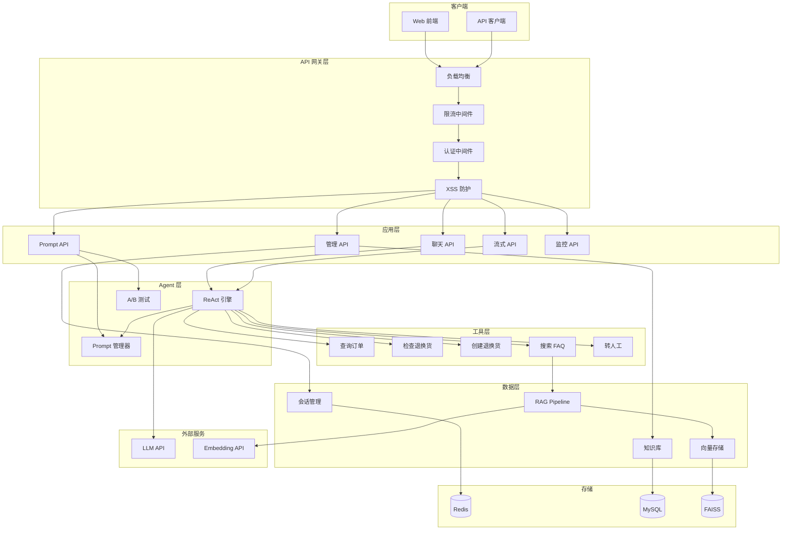
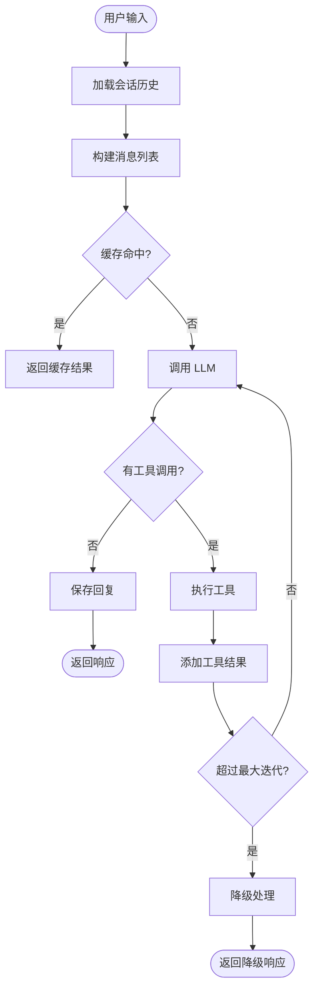
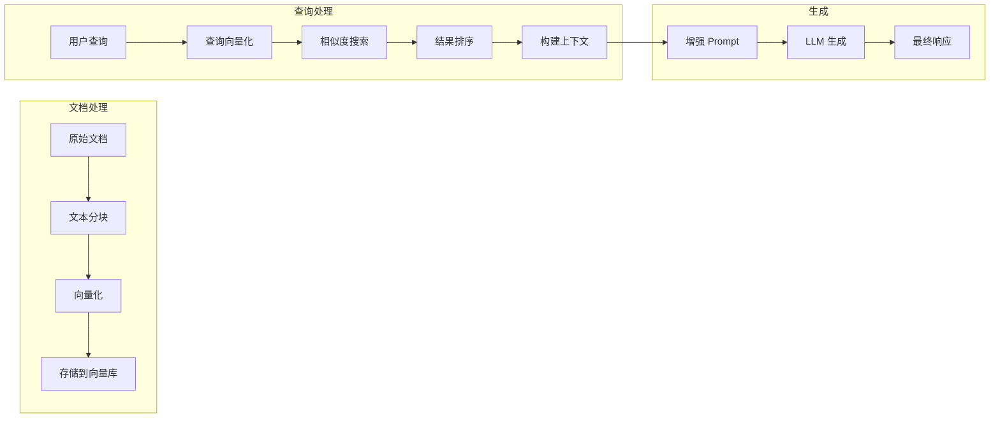
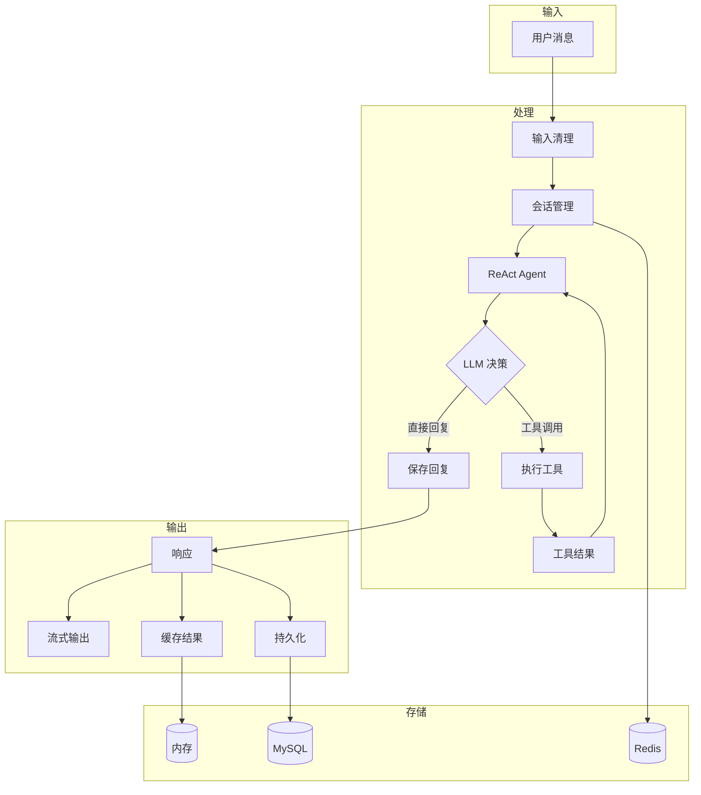
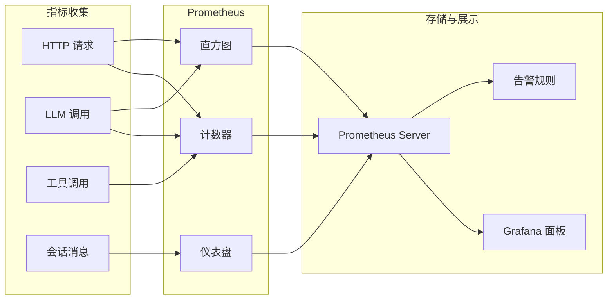
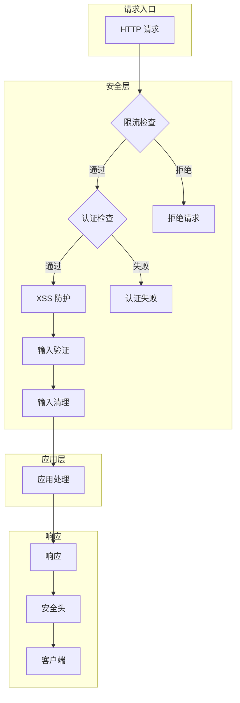

# 灵犀智能客服系统 - 架构设计

## 系统架构图

```mermaid
graph TB
    subgraph "客户端"
        Web[Web 前端]
        API_Client[API 客户端]
    end

    subgraph "API 网关层"
        LB[负载均衡]
        RateLimit[限流中间件]
        Auth[认证中间件]
        XSS[XSS 防护]
    end

    subgraph "应用层"
        ChatAPI[聊天 API]
        StreamAPI[流式 API]
        AdminAPI[管理 API]
        PromptAPI[Prompt API]
        MetricsAPI[监控 API]
    end

    subgraph "Agent 层"
        ReAct[ReAct 引擎]
        PromptMgr[Prompt 管理器]
        ABTest[A/B 测试]
    end

    subgraph "工具层"
        CheckOrder[查询订单]
        CheckReturn[检查退换货]
        CreateReturn[创建退换货]
        SearchFAQ[搜索 FAQ]
        Transfer[转人工]
    end

    subgraph "数据层"
        RAG[RAG Pipeline]
        VectorStore[向量存储]
        Knowledge[知识库]
        Session[会话管理]
    end

    subgraph "存储"
        Redis[(Redis)]
        MySQL[(MySQL)]
        FAISS[(FAISS)]
    end

    subgraph "外部服务"
        LLM[LLM API]
        Embedding[Embedding API]
    end

    Web --> LB
    API_Client --> LB
    LB --> RateLimit
    RateLimit --> Auth
    Auth --> XSS
    XSS --> ChatAPI
    XSS --> StreamAPI
    XSS --> AdminAPI
    XSS --> PromptAPI
    XSS --> MetricsAPI

    ChatAPI --> ReAct
    StreamAPI --> ReAct
    AdminAPI --> Knowledge
    AdminAPI --> Session
    PromptAPI --> PromptMgr
    PromptAPI --> ABTest

    ReAct --> PromptMgr
    ReAct --> CheckOrder
    ReAct --> CheckReturn
    ReAct --> CreateReturn
    ReAct --> SearchFAQ
    ReAct --> Transfer

    SearchFAQ --> RAG
    RAG --> VectorStore
    RAG --> Embedding

    Session --> Redis
    Knowledge --> MySQL
    VectorStore --> FAISS

    ReAct --> LLM
```

## ReAct 循环流程图

```mermaid
flowchart TD
    Start([用户输入]) --> LoadHistory[加载会话历史]
    LoadHistory --> BuildMessages[构建消息列表]
    BuildMessages --> CheckCache{缓存命中?}

    CheckCache -->|是| ReturnCache[返回缓存结果]
    CheckCache -->|否| CallLLM[调用 LLM]

    CallLLM --> HasToolCall{有工具调用?}

    HasToolCall -->|否| SaveResponse[保存回复]
    SaveResponse --> ReturnResponse([返回响应])

    HasToolCall -->|是| ExecuteTools[执行工具]
    ExecuteTools --> AddToolResults[添加工具结果]
    AddToolResults --> CheckIteration{超过最大迭代?}

    CheckIteration -->|否| CallLLM
    CheckIteration -->|是| Fallback[降级处理]
    Fallback --> ReturnFallback([返回降级响应])
```

## RAG 检索流程图

```mermaid
flowchart LR
    subgraph "文档处理"
        Doc[原始文档] --> Split[文本分块]
        Split --> Embed[向量化]
        Embed --> Store[存储到向量库]
    end

    subgraph "查询处理"
        Query[用户查询] --> QueryEmbed[查询向量化]
        QueryEmbed --> Search[相似度搜索]
        Search --> Rank[结果排序]
        Rank --> Context[构建上下文]
    end

    subgraph "生成"
        Context --> Augment[增强 Prompt]
        Augment --> LLM[LLM 生成]
        LLM --> Response[最终响应]
    end
```

## 数据流向图

```mermaid
flowchart TB
    subgraph "输入"
        UserMsg[用户消息]
    end

    subgraph "处理"
        UserMsg --> Sanitize[输入清理]
        Sanitize --> Session[会话管理]
        Session --> Agent[ReAct Agent]

        Agent --> LLM{LLM 决策}
        LLM -->|直接回复| Save[保存回复]
        LLM -->|工具调用| Tool[执行工具]

        Tool --> Result[工具结果]
        Result --> Agent
    end

    subgraph "输出"
        Save --> Response[响应]
        Response --> Stream[流式输出]
        Response --> Cache[缓存结果]
        Response --> Persist[持久化]
    end

    subgraph "存储"
        Session --> Redis[(Redis)]
        Persist --> MySQL[(MySQL)]
        Cache --> Memory[(内存)]
    end
```

## 监控指标架构

```mermaid
graph LR
    subgraph "指标收集"
        HTTP[HTTP 请求]
        LLM_Call[LLM 调用]
        Tool_Call[工具调用]
        Session_Msg[会话消息]
    end

    subgraph "Prometheus"
        Counter[计数器]
        Histogram[直方图]
        Gauge[仪表盘]
    end

    subgraph "存储与展示"
        Prometheus_Server[Prometheus Server]
        Grafana[Grafana 面板]
        Alert[告警规则]
    end

    HTTP --> Counter
    HTTP --> Histogram
    LLM_Call --> Counter
    LLM_Call --> Histogram
    Tool_Call --> Counter
    Session_Msg --> Gauge

    Counter --> Prometheus_Server
    Histogram --> Prometheus_Server
    Gauge --> Prometheus_Server

    Prometheus_Server --> Grafana
    Prometheus_Server --> Alert
```

## 安全防护架构

```mermaid
flowchart TB
    subgraph "请求入口"
        Request[HTTP 请求]
    end

    subgraph "安全层"
        Request --> RateLimit{限流检查}
        RateLimit -->|通过| Auth{认证检查}
        RateLimit -->|拒绝| Block1[拒绝请求]

        Auth -->|通过| XSS[XSS 防护]
        Auth -->|失败| Block2[认证失败]

        XSS --> Validate[输入验证]
        Validate --> Sanitize[输入清理]
    end

    subgraph "应用层"
        Sanitize --> App[应用处理]
    end

    subgraph "响应"
        App --> Response[响应]
        Response --> Headers[安全头]
        Headers --> Client[客户端]
    end
```
